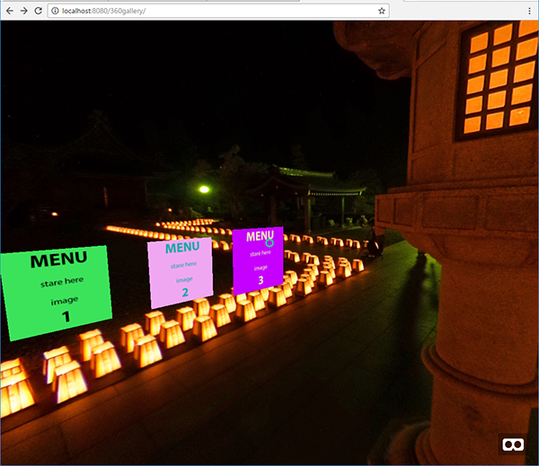
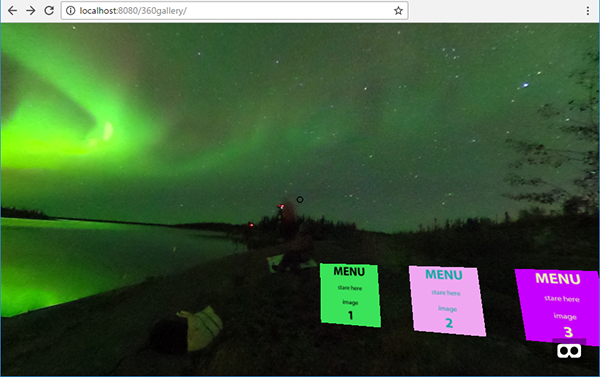

# RICOH THETA 360 Image Gallery Tutorial with A-Frame

This is the third THETA 360 tutorial on A-Frame.  The tutorials
were made for the
[RICOH THETA Developers SF Bay Area Meetup Group](https://www.meetup.com/RICOH-THETA-Developers-SF-Bay-Area/)
as a way to quickly help beginners get a taste of A-Frame.

Previous Tutorials

1. [Tutorial 1: Navigate a single 360 image sphere](https://github.com/theta360developers/aframe-demo)
2. [Tutorial 2: Create a 360 image gallery from 3 images](https://github.com/theta360developers/360gallery)

These tutorials leverage the *Building an Advanced Scene* guide of the A-Frame documentation.

## Quick Preview

Click on the link below:

https://codetricity.github.io/360gallery/

## Usage

You must run a local web server or load the code up onto GitHub Pages.
The files will not work if you open them directly in a browser.
The demo is intended to be used in a headset. You can test it on a
desktop and simulate the experience.

### Navigation
Move your head to place the black ring over the menu. It will turn green. After a few seconds, it will move to the image that the
menu points to.

If you are using a mouse, you can move the ring onto the menu square
and then click anywhere on the screen.

## Dependencies

- [A-Frame](https://github.com/aframevr/aframe)
- [K-Frame](https://github.com/ngokevin/k-frame)

## Controller
There's a simple Python script to take pictures from your local computer using a simple GUI that is mockup of a mobile phone. The script will move the pictures from the camera and store them in `/img/`. If you want to use this function, you'll need to edit `index.html`. It's commented.

The controller requires

* Python 2.7 (or around there)
* Python Pygame library
* Python requests library (for HTTP requests)

If you integrate it into a web server, the easiest way to save the pictures into `/var/www/` is to run the controller as root. I'm storing my git repo in `/var/www` for the demo.

---

## Screenshots

